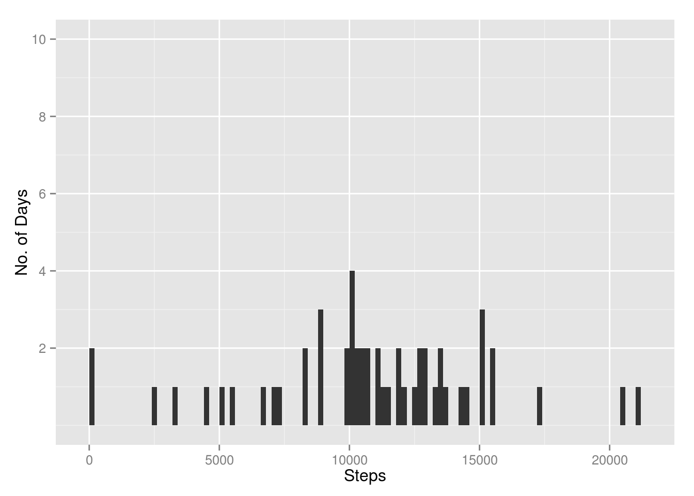
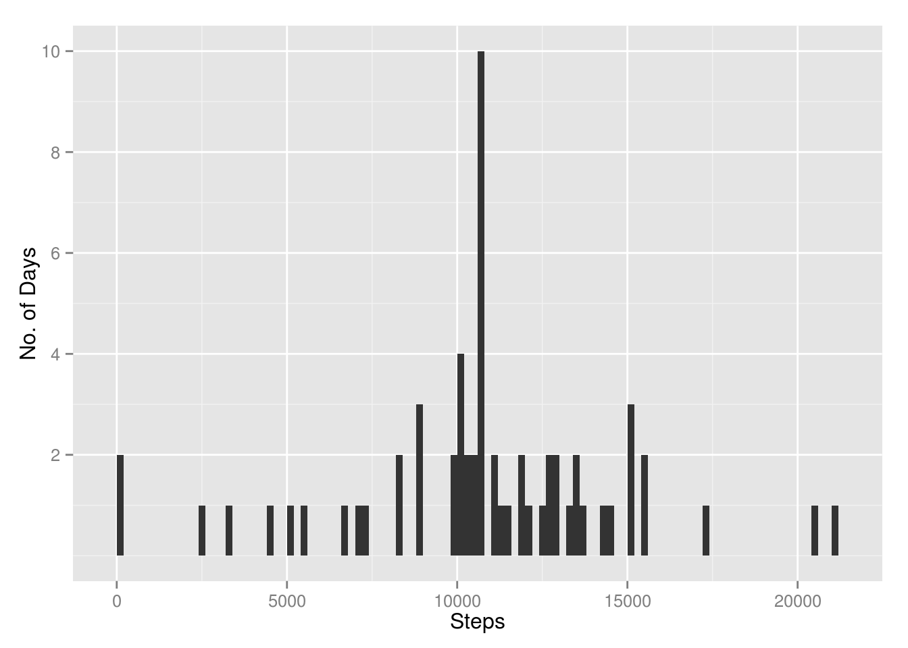
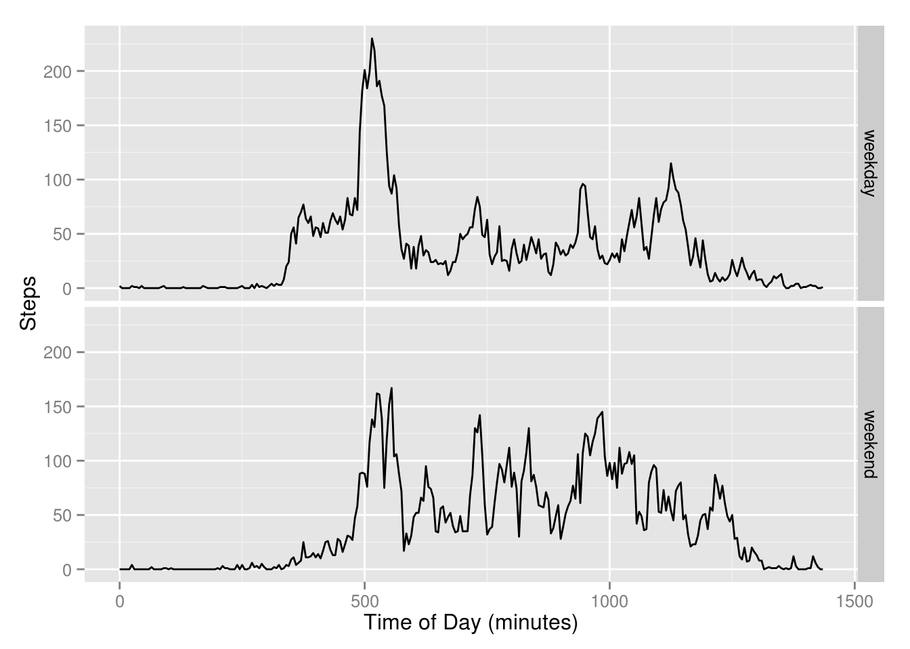

---
title: "Reproducible Research- Peer Assessment 1"
output: html_document
---


## Loading and preprocessing the data


The necessary packages are loaded and he data is read into a dataframe called 'act':


```r
library(ggplot2)
library(plyr)
act <- read.csv('/home/tom/Dropbox/Coursera_Repo_research/activity.csv',
        header = TRUE)
```

The date variable is converted to a Date type.  A column corresponding to the length of the day in minutes is added:


```r
act$date <- as.Date(act$date)
minutes <- seq(0,1435,5)
act$minutes <- minutes
```

The amount of NA values are determined and then omitted in new dataframe 'actnoNA'


```r
sapply(act, function(x) sum(is.na(x)))
```

```
##    steps     date interval  minutes 
##     2304        0        0        0
```

```r
actnoNA <- na.omit(act) 
```

A histogram is the made of steps taken per day:


```r
TotalSteps <- ddply(actnoNA, .(date), summarise,
                  Total   = sum(steps))
ggplot(data=TotalSteps, aes(Total)) + 
              geom_bar(stat="bin", binwidth = 200) +
              xlab('Steps') + ylab('No. of Days') +
               scale_y_continuous(limits=c(0,10), breaks =c(2,4,6,8,10))
```

 

The y-axis  scale goes to 10 to allow it to be compared to the second histogram below.

## What is mean total number of steps taken per day?

The mean and median values for each day  of the week are then calculated:


```r
sum.actnoNA <- ddply(actnoNA, c("date"), summarise, sum.steps = sum(steps))
print(round(mean(sum.actnoNA$sum.steps)))
```

```
## [1] 10766
```

```r
print(median(sum.actnoNA$sum.steps))
```

```
## [1] 10765
```

## What is the average daily activity pattern?

The plyr package is used to determine the  number of steps taken for each interval, averaged over the dataset. The resulting time series
is then plotted.  The x-axis shows the length of the day in minutes.


```r
plyractnoNA <- ddply(actnoNA, .(interval), summarise,
                  N    = length(steps),
                  mean = round(mean(steps)),
                  median   = median(steps))
plyractnoNA$minutes <- minutes
plot(plyractnoNA$minutes, plyractnoNA$mean, type = 'l',  xlab = 'Time of Day (minutes)', ylab = 'Steps')
```

 

The maximum number of steps occurs at 515 - 520 minutes into the day or at 8:35 - 8:40am.  On average 206 steps are taken in this period.
 
## Imputing missing values
 
As seen earlier there are 2304 NA values for the steps variable.  The above analysis omits these observations.  Now the NA values will be replaced with the mean value for the appropriate interval:


```r
act$mean <-plyractnoNA$mean
ind <-which(is.na(act$steps)) 
act$steps[ind] <- plyractnoNA$mean
```

A histogram is created from the revised dataframe:


```r
TotalSteps2 <- ddply(act, .(date), summarise,
                  Total   = sum(steps))
ggplot(data=TotalSteps2, aes(Total)) + 
              geom_bar(stat="bin", binwidth = 200) +
              xlab('Steps') + ylab('No. of Days') +
              scale_y_continuous(limits=c(0, 10), breaks =c(2,4,6,8,10))
```

 

From the histogram the number of days with around 11 000 steps has increased from 4 days to 10 days. All days with NA values use the number of steps from an average day so it is not surprising that this spike appears near the middle of the range.


The mean and median step values for each weekday is calculated:


```r
sum.act <- ddply(act, c("date"), summarise, sum.steps = sum(steps))
print(round(mean(sum.act$sum.steps)))
```

```
## [1] 10766
```

```r
print(median(sum.act$sum.steps))
```

```
## [1] 10762
```

There is little difference for these values between the no NA and NAs imputed cases.

## Are there differences in activity patterns between weekdays and weekends?

The effect of weekdays vs weekend days is now considered.  A weekday/weekend factor is created in the dataframe:


```r
act$wkwkend <- "weekday"
ind2 <-which(weekdays(act$date) %in% c("Sunday", "Saturday")) 
act$wkwkend[ind2] <- "weekend"
act$wkwkend <- as.factor(act$wkwkend)
```

The average number of steps taken for each interval for the two cases is calculated:


```r
plyract <- ddply(act, .(interval,wkwkend), summarise,
                     N  = length(steps),
                     mean = round(mean(steps)),
                     median = median(steps))
plyract$minutes <- rep(seq(0,1435,5), each=2)
```


A plot of the average steps per interval for the two cases is created:


```r
ggplot(plyract, aes(minutes,mean)) + geom_line(size = 0.5) +facet_grid(wkwkend ~.) +
              theme(legend.position="none") + xlab('Time of Day (minutes)') + ylab('Steps')
```

 

The weekend case shows the steps are more equally distributed throughout the day, with activity starting slightly later in the morning and continuing on to later in the day.
